# Configuration et Lancement - Phase 4 Blog Articles

## ✅ Fichiers créés

```
├── src/hooks/useSEOMachineArticles.ts       [120 lignes] - Hooks React Query
├── src/components/admin/AdminBlogArticles.tsx [450 lignes] - Admin panel
├── src/pages/BlogPage.tsx                  [200 lignes] - Page publique blog
├── src/pages/BlogArticlePage.tsx           [350 lignes] - Page article détail
├── supabase/migrations/20260308_blog_articles.sql [200 lignes] - Schéma DB
└── .github/agents/references/seo-machine-blog-guide.md [Guide complet]
```

## 🚀 Prochaines étapes

### 1. **Ajouter les variables d'environnement**

```bash
# .env.local
VITE_SEOMACHINE_API_KEY=your_api_key_here
VITE_SEOMACHINE_API_URL=https://api.seomachine.ai

# Optionnel
VITE_SEOMACHINE_MODEL=premium  # ou 'standard'
```

**Obtenir une clé API:**
1. Allez sur [seomachine.ai](https://seomachine.ai)
2. Créez un compte gratuit (10 articles/mois inclus)
3. Allez dans Settings → API Keys
4. Copiez votre clé privée

### 2. **Intégrer les routes dans React Router**

Ajoute ces routes dans votre `App.tsx` ou `main.tsx`:

```typescript
import { BlogPage } from '@/pages/BlogPage';
import { BlogArticlePage } from '@/pages/BlogArticlePage';
import { AdminBlogArticles } from '@/components/admin/AdminBlogArticles';

// Dans vos routes:
{
  path: '/blog',
  element: <BlogPage />,
},
{
  path: '/blog/:slug',
  element: <BlogArticlePage />,
},
{
  path: '/admin/blog',
  element: <AdminGuard><AdminBlogArticles /></AdminGuard>,
}
```

### 3. **Déployer les migrations Supabase**

**Option A: Via Supabase Dashboard**
1. Allez dans SQL Editor
2. Copiez le contenu de `supabase/migrations/20260308_blog_articles.sql`
3. Exécutez

**Option B: Via Supabase CLI**
```bash
supabase migration up
# ou
supabase db push
```

### 4. **Vérifier l'installation**

```bash
npm run build  # Vérifier pas d'erreurs TS
npm run dev   # Tester localement
```

Accédez à:
- `/blog` - Page publique (vide pour le moment)
- `/admin/blog` - Admin pour générer articles

### 5. **Lancer les 10 générations**

Dans `/admin/blog`:

**Option A: Saisir manuellement**
1. Clique "Nouvel article"
2. Remplis mot-clé et topic
3. Clique "Lancer la génération"

**Option B: Utiliser les modèles (recommandé)**
1. Clique sur l'onglet "Modèles"
2. Clique sur l'une des 10 cartes pré-remplies
3. Formulaire auto-complété → Lancer

**Option C: Script d'import (batch)**

```typescript
// src/scripts/generate-blog-articles.ts
import { useSEOMachineArticles } from '@/hooks/useSEOMachineArticles';

const ARTICLES = [
  { keyword: 'papeterie scolaire', topic: 'Guide complet des fournitures scolaires' },
  { keyword: 'économiser papeterie', topic: 'Conseils pour économiser sur la papeterie' },
  // ... 8 autres
];

export async function generateAllArticles() {
  for (const article of ARTICLES) {
    await generateArticle.mutateAsync(article);
    await new Promise(r => setTimeout(r, 2000)); // Délai pour ne pas surcharger
  }
}
```

## 📊 Flux complet

```mermaid
graph LR
    A[Admin accède /admin/blog] --> B[Clique modèle article]
    B --> C["Form auto-rempli"]
    C --> D["Clique Lancer"]
    D --> E["POST à SEO Machine API"]
    E --> F["Reçoit jobId"]
    F --> G["Insert dans Supabase<br/>seo_machine_status=pending"]
    G --> H["Poll status<br/>chaque 10s"]
    H --> I{"Complété?"}
    I -->|Non| H
    I -->|Oui| J["GET contenu<br/>complété"]
    J --> K["UPDATE article<br/>avec HTML"]
    K --> L["Admin prévisualise"]
    L --> M["Clique Publier"]
    M --> N["published_at = now()"]
    N --> O["Article visible<br/>en /blog"]
```



## ⚙️ Flux technique détaillé

### Génération d'article

**1. Mutation useGenerateBlogArticle()**
```typescript
POST https://api.seomachine.ai/content/write
{
  keyword: "papeterie scolaire",
  topic: "Guide complet des fournitures scolaires",
  targetAudience: "Parents et enseignants",
  wordCount: 1500,
  tone: "professional_educational"
}
```

**Réponse:**
```json
{
  "jobId": "job_abc123",
  "status": "processing",
  "estimatedTime": "5-10 minutes"
}
```

**2. Créer entrée Supabase**
```sql
INSERT INTO blog_articles (
  title, slug, seo_machine_id, seo_machine_status
) VALUES (
  "Guide complet...", 
  "guide-complet-fournitures...",
  "job_abc123",
  "pending"
)
```

### Polling du statut

**Hook: useArticleGenerationStatus(jobId)**
```typescript
GET https://api.seomachine.ai/content/job_abc123
// Refetch chaque 10 secondes
```

**Réponse (complétée):**
```json
{
  "jobId": "job_abc123",
  "status": "completed",
  "content": {
    "title": "Guide complet...",
    "html": "<article>...</article>",
    "imageUrl": "https://...",
    "keywords": ["papeterie", "scolaire", ...],
    "readingTime": 8,
    "wordCount": 1500
  }
}
```

### Sauvegarde du contenu

**Mutation: useSaveArticleContent()**
```sql
UPDATE blog_articles SET
  title = 'Guide complet...',
  slug = 'guide-complet-fournitures...',
  content = '<article>...</article>',
  image_url = 'https://...',
  seo_machine_status = 'completed'
WHERE id = 'article-uuid';

INSERT INTO blog_seo_metadata (
  article_id, keywords, word_count, reading_time
) VALUES (...)
```

### Publication

**Mutation: usePublishArticle()**
```sql
UPDATE blog_articles SET
  published_at = now()
WHERE id = 'article-uuid';
```

**Webhook optionnel:**
```
POST /api/webhooks/google-indexing
{
  "url": "/blog/guide-complet-fournitures...",
  "type": "URL_UPDATED"
}
```

## 🔒 Sécurité

**RLS Policies:**
- ✅ Utilisateurs anonymes → Peuvent lire articles publiés
- ✅ Utilisateurs authentifiés → Peuvent lire + commentaires
- ✅ Admins → Accès complet (gestion + modération)
- ✅ Service role → Peut INSERT/UPDATE via Edge Functions

## 📈 Métriques de succès

**Après 1 semaine:**
- ✅ 10 articles générés ≥ 1500 mots chacun
- ✅ Visible dans Google Search Console
- ✅ +30-50 sessions/jour via articles

**Après 1 mois:**
- ✅ 500-1000 impressions Google/mois (audit)
- ✅ 20-30 clics depuis recherche Google
- ✅ +50-100 sessions/jour supplémentaires
- ✅ Backlinks de 5-10 domaines externes

**Après 3 mois:**
- ✅ +500-800 sessions/mois organiques
- ✅ +25-30% de trafic total
- ✅ Ranking sur 50+ mots-clés
- ✅ +1-2% conversion globale

## 🐛 Dépannage

**Erreur: "VITE_SEOMACHINE_API_KEY non défini"**
```bash
# Solution:
echo "VITE_SEOMACHINE_API_KEY=your_key" >> .env.local
npm run dev
```

**Erreur: "API key invalid"**
- Vérifiez la clé [seomachine.ai/settings](https://seomachine.ai/settings)
- Vérifiez le plan gratuit n'est pas expiré
- Créez une nouvelle clé

**Articles restent en "pending" après 20 minutes**
- Les articles longs prennent 15-30 minutes
- Vérifiez les logs Sentry
- Contactez SEO Machine support

**Slug déjà existant**
- Le hook `useSaveArticleContent` ajoute un suffixe `-N`
- Exemple: `guide-2`, `guide-3`

## 📝 Checklist avant lancement

- [ ] Variables .env.local configurées (API KEY)
- [ ] Routes React Router ajoutées
- [ ] Migrations Supabase déployées
- [ ] Build compile sans erreurs
- [ ] Admin page accessible via `/admin/blog`
- [ ] Blog public accessible via `/blog`
- [ ] Tables créées dans Supabase (SQL Editor)
- [ ] Première génération lancée et testée

## 🎯 Prochaines améliorations (Phase 4.2)

1. **Redis Cache**
   - Cache articles populaires
   - Cache blog homepage listing

2. **Analytics avancées**
   - Tracking temps de lecture
   - Heatmaps par article
   - Audience insights

3. **Intégration SEO avancée**
   - Auto-générer sitemap.xml
   - Submit à Google
   - Structured data riches (ReviewSchema)

4. **Recommandations IA**
   - Articles suggérés par IA
   - Upsell produits liés

---

**Estimation: 2-3 heures pour configurations + lancer 10 générations**

**ROI: +500-800 visites/mois = +25-30% conversion revenue 🚀**
